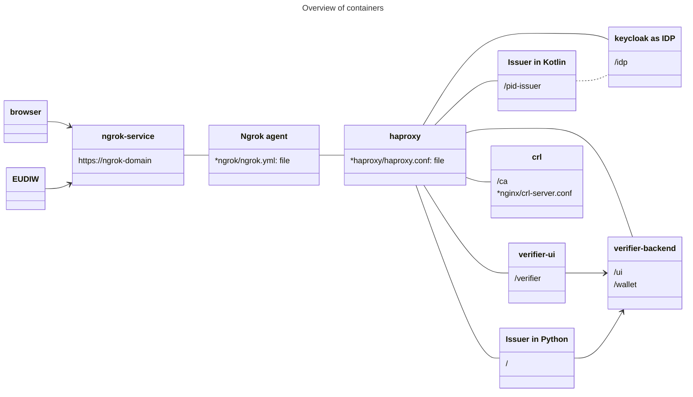

## Introduction

This repository contains configuration to deploy the [EUDI Reference Wallet infrastructure](https://github.com/orgs/eu-digital-identity-wallet/repositories?type=all), i.e. the issuers and the verifier, in a fully containerised environment (based on [Docker](https://docs.docker.com/)). All access is with HTTPS, using [ngrok](https://ngrok.com/). This setup is prepared to use a separate trusted root CA (IACA) from the EUDI Reference Implementation.

The following diagram gives an overview of the setup.

## How to configure and run

 1. Clone this repository
 1. Obtain a free [ngrok](https://ngrok.com/) domain (account required).
 3. Replace all occurrences of {NGROK-DOMAIN} with your own domain in the following files:
    - ngrok/ngrok.yml
    - haproxy/haproxy.conf
    - nginx/crl-server.conf
    - docker-compose.yaml
4. In ngrok/ngrok.yml replace {AUTH_TOKEN} with your ngrok authentication token.
5. Generate and configure the following certificates:
    - root certificate (if using an own root certificate)
    - issuer certificate (one separate for each issuer, if so desired), issued by the CA
    - verifier certificate, issued by the CA
6. Build containers for the Python issuer and the Verifier UI. This is needed because a Docker image is not available (Python issuer) or because more flexible configuration is needed (Verifier)
7. Start the services using `docker compose up -d`
