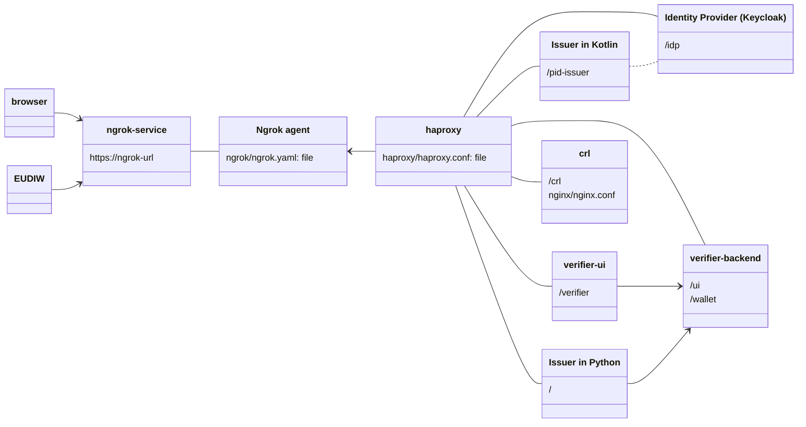

## Deployment of EUDI Reference Implementation

```mermaid
classDiagram
    direction LR

    class browser { }

    class EUDIW { }
    
    class ngrok-service { 
        https://ngrok-url
    }

    class ngrok["Ngrok agent"] {  
        ngrok/ngrok.yaml: file
    }

    class haproxy { 
        haproxy/haproxy.conf: file
    }
    
    class verifier-ui { 
        /verifier
    }
    
    class verifier-backend {
        /ui
        /wallet
    }
    
    class py-issuer["Issuer in Python"] { 
        /
    }
    
    class pid-issuer["Issuer in Kotlin"] {
        /pid-issuer
    }

    class idp["Identity Provider (Keycloak)"] {
        /idp
    } 

    class crl {
        /crl
        nginx/nginx.conf
    }

    browser --> ngrok-service
    EUDIW --> ngrok-service
    ngrok-service -- ngrok
    ngrok <-- haproxy
    haproxy -- pid-issuer
    haproxy -- idp
    pid-issuer .. idp
    haproxy -- py-issuer
    haproxy -- crl
    haproxy -- verifier-ui
    haproxy -- verifier-backend
    verifier-ui --> verifier-backend
    py-issuer --> verifier-backend
```