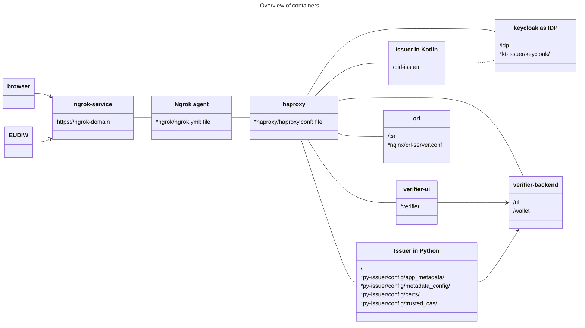

## Introduction

This repository contains configuration to deploy the [EUDI Reference Wallet infrastructure](https://github.com/orgs/eu-digital-identity-wallet/repositories?type=all), i.e. the issuers and the verifier, in a fully containerised environment (based on [Docker](https://docs.docker.com/)). All access is with HTTPS, using [ngrok](https://ngrok.com/). This setup is prepared to use a separate trusted root CA (IACA) from the EUDI Reference Implementation. The purpose is to run all components on one server, and expose the interfaces over the Internet for demonstration and testing.

The configuration in this repository is based on that of the official EUDI Reference Wallet repositories.

*The configuration in this repository is NOT suited for use in an production environment.*

The following diagram gives an overview of the setup.


## How to build Python issuer and Verifier UI containers

### Python issuer
The Python issuer is not yet available as a Docker container, so we build one ourselves.
1. Clone the original [repository](https://github.com/eu-digital-identity-wallet/eudi-srv-web-issuing-eudiw-py).
2. Build the container:
    ```
    cd <cloned-repo>
    cp <py-issuer>/Dockerfile .
    docker build -t py-issuer .
    ```

### Verifier UI
The default Verifier UI can only deployed on the `/` context root. As we want to deploy on `/verifier`, a minor patch is needed.

1. Clone the original [repository](https://github.com/eu-digital-identity-wallet/eudi-web-verifier).
2. Apply the patch in the verifier-ui directory of this repository to the cloned repository: 
    ```
    cd <cloned-repo>
    patch -p1 < <verifier-ui>/package.json.patch
    ```
3. Build the container:
    ```
    cd <cloned-repo>
    docker build -t verifier-ui .
    ```

## How to configure and run

 1. Clone this repository
 1. Obtain a free [ngrok](https://ngrok.com/) domain (account required).
 3. Replace all occurrences of `{NGROK_DOMAIN}` with your own domain in the following files:
    - ngrok/ngrok.yml
    - haproxy/haproxy.conf
    - nginx/crl-server.conf
    - docker-compose.yaml
    - py-issuer/config/app_config/config_service.py
    - py-issuer/config/app_config/oid_config.json
    - py-issuer/config/metadata_config/metadata_config.json
    - py-issuer/config/metadata_config/openid-configuration.json
   You can use the command
    ```
    perl -p -i -e 's/{NGROK_DOMAIN}/your.ngrok.domain/gx' ngrok/ngrok.yml haproxy/haproxy.conf nginx/crl-server.conf docker-compose.yaml py-issuer/config/app_config/config_service.py py-issuer/config/app_config/oid_config.json py-issuer/config/metadata_config/metadata_config.json py-issuer/config/metadata_config/openid-configuration.json
    ```
4. In ngrok/ngrok.yml replace `{AUTH_TOKEN}` with your ngrok authentication token.
5. Generate and configure the following certificates:
    - root certificate (if using an own root certificate; if so make sure the root certificate is included in the wallet build)
    - issuer certificate (one separate for each issuer, if so desired), issued by the CA
    - verifier certificate, issued by the CA
6. Set the passwords for the keystores and the private keys in `docker-compose.yaml`, i.e. the following environment variables:
    - pid-issuer (Kotlin issuer):
        - ISSUER_SIGNING_KEY_KEYSTORE_PASSWORD
        - ISSUER_SIGNING_KEY_PASSWORD
    - verifier (verifier backend):
        - VERIFIER_JAR_SIGNING_KEY_KEYSTORE_PASSWORD
        - VERIFIER_JAR_SIGNING_KEY_PASSWORD
7. For the Python issuer:
    - in py-issuer/config/trusted_cas add the root certificates (PEM-encoded with file extension .pem) of additional CAs
    - in py-issuer/config add a directory keys and put there the private key and certifcate with which to sign attestations, named 'py-issuer.key' and 'py-issuer.der' respectively. The certificate must be DER-encoded.
8. Build containers for the Python issuer and the Verifier UI. This is needed because a Docker image is not available (Python issuer) or because more flexible configuration is needed (Verifier). See [section below on how to build these containers](#how-to-build-python-issuer-and-verifier-ui-container).
9. If you are not using an own root certificate, comment out the crl service section in `docker-compose.yaml`, and remove the nginx dependency of the haproxy service in that same file.
10. Start the services using `docker compose up -d`. Verify that all containers are running using `docker ps`; it should list 7 running containers. Stop services with `docker compose down`.
11. Access your services using https, at your Ngrok domain with context root:
    - /verifier for the verifier,
    - /pid-issuer for the Kotlin issuer,
    - / for the Python issuer.

    The API for the Verifier is available at context roots /ui and /wallet. See also the above diagram.